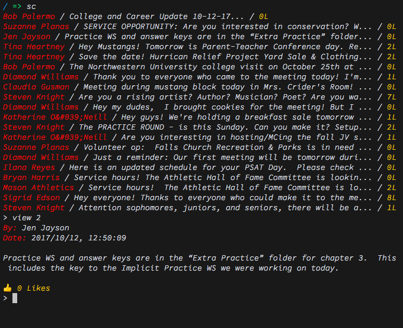

``sc``
======

``sc`` is a helpful tool for interacting with Schoology via the command line.

Why?
----
Because it's fun to do things in the terminal. Also, using ``sc`` is much lighter than loading an entire webpage.

How?
----
To install sc, simply ``cd`` into the appropriate directory and run ``sudo make install``. Alternatively, you may move ``sc.py`` to whatever directory in your path you desire and remove its extension.

Once ``sc`` is installed, you may run it like any other program: type ``sc`` into your favorite terminal emulator.

On launch, the program will display a list of posts, much like that which would appear on your homepage. You may then enter commands such as ``view 0`` to view the first (zeroth) update in greater detail. You may also type ``groups`` to view groups of which you are a member and further options therein.

MORE DOCUMENTATION COMING.

Who?
----
``sc`` was created by `Erik Boesen <https://github.com/ErikBoesen>`_. It is made available under the `MIT License <LICENSE>`_.
